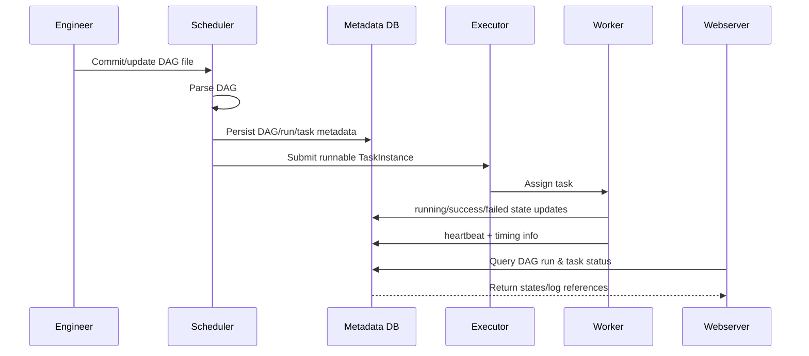

# Apache Airflow: Overall Architecture

This document gives a high-level architecture view of Apache Airflow and explains how core components interact during DAG parsing, scheduling, and task execution.

## 1) High-level architecture diagram

```mermaid
flowchart LR
    U[User / Engineer] -->|Creates DAG code| DAGS[DAG Files]

    subgraph Airflow Control Plane
      WS[Webserver]
      SCH[Scheduler]
      TP[Triggerer\nDeferrable tasks]
    end

    subgraph Metadata Layer
      MDB[(Metadata Database)]
    end

    subgraph Execution Layer
      EXE[Executor\n(Local/Celery/Kubernetes)]
      WKR[Workers / Task Runtimes]
    end

    subgraph Optional Runtime Integrations
      MSG[(Message Broker\nRedis/RabbitMQ)]
      LOGS[(Remote Logs\nS3/GCS/Elastic)]
      EXT[(External Systems\nAPIs/DBs/Data Lake)]
    end

    DAGS -->|Scan & parse DAG definitions| SCH
    SCH <--> MDB
    WS <--> MDB
    TP <--> MDB

    SCH -->|Queue TaskInstances| EXE
    EXE -->|Dispatch work| WKR

    EXE <-->|Celery mode| MSG
    WKR -->|Read/Write task state| MDB
    WKR -->|Run operators/hooks| EXT
    WKR -->|Emit logs| LOGS

    WS -->|Browse DAGs/runs/logs| U
```

---

## 2) Core components and responsibilities

### Webserver
- Hosts the UI and API for browsing DAGs, runs, tasks, logs, and configurations.
- Reads state from the metadata database.
- Does **not** schedule work itself.

### Scheduler
- Continuously parses DAG files.
- Decides when DAG runs and task instances should be created.
- Applies dependencies, trigger rules, concurrency, pools, and limits.
- Hands runnable tasks to the configured executor.

### Executor
Executor determines *how* queued tasks are executed:
- **LocalExecutor**: runs tasks as local processes on the scheduler host.
- **CeleryExecutor**: pushes tasks to a broker and workers consume them.
- **KubernetesExecutor**: launches one Kubernetes pod per task.

### Workers
- Execute operator code for each task instance.
- Send heartbeats and task state transitions to metadata DB.
- Write logs locally and optionally to remote logging backends.

### Metadata Database
- System of record for Airflow state:
  - DAG runs, task instances, states, variables, connections, users, etc.
- Used by scheduler, webserver, triggerer, and workers.

### Triggerer (for deferrable operators)
- Runs async triggers for deferred tasks.
- Reduces worker slot usage for long waits (e.g., external event/sensor waits).

---

## 3) End-to-end task lifecycle

1. **Authoring**: engineer writes DAG Python files.
2. **Parsing**: scheduler parses DAGs and stores serialized metadata.
3. **Scheduling**: scheduler creates `DagRun` and `TaskInstance` records.
4. **Queueing**: scheduler marks runnable tasks as queued and submits to executor.
5. **Execution**: worker picks task, executes operator logic, updates state.
6. **Observability**: logs and states are exposed in webserver UI/API.
7. **Completion**: task and DAG run terminal states are recorded in metadata DB.

---

## 4) Logical data flow sequence



---

## 5) Deployment patterns

### Single-node learning setup
- Webserver + Scheduler + LocalExecutor + Metadata DB in one environment.
- Best for learning and lightweight workloads.

### Distributed Celery setup
- Webserver, Scheduler, Triggerer, Celery workers, metadata DB, and broker.
- Scales horizontally by increasing worker replicas.

### Kubernetes-native setup
- Scheduler + Webserver + Triggerer run as services.
- Each task runs in ephemeral pod via KubernetesExecutor.
- Strong isolation and elastic scaling.

---

## 6) Reliability and scaling considerations

- Use **PostgreSQL/MySQL** for production metadata DB (not SQLite).
- Configure worker concurrency, DAG-level concurrency, pools, and priorities.
- Enable remote logging for durable centralized logs.
- Separate parse load from execution load in larger environments.
- Use deferrable operators and triggerer for long waits to save worker capacity.

---

## 7) Security model overview

- RBAC in webserver for user/team access.
- Connections and Variables can be backed by secrets managers.
- Network policy controls between webserver/scheduler/workers/DB/broker.
- TLS and authentication should be enforced for production endpoints.

---

## 8) Quick architecture checklist

- [ ] Metadata DB is external and production-grade.
- [ ] Executor matches workload scale (Local/Celery/Kubernetes).
- [ ] Scheduler health and parsing performance are monitored.
- [ ] Remote logs are enabled.
- [ ] Worker autoscaling strategy is defined.
- [ ] Alerts for failed DAGs/tasks are configured.

